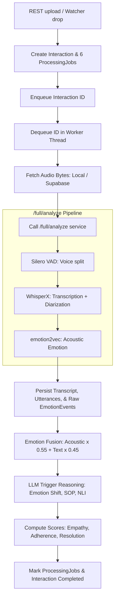

# VocalMind Audio Processing Pipeline

This document outlines the end-to-end data flow of VocalMind's audio processing pipeline, which runs asynchronously whenever an audio file is uploaded or discovered by the background watcher.

---

## 1. Pipeline Architecture Flowchart

Below is a detailed representation of the audio processing pipeline from initial audio intake to relational database persistence and RAG evaluation:

---

## 2. Step-by-Step Processing Pipeline

When the background worker pops an interaction ID from the async queue, it executes the following steps:

1.  **DB Session Release**: Releases the main database session during heavy network I/O to avoid pool exhaustion.
2.  **Audio Retrieval**: Downloads or resolves the file using `app/core/audio_resolver.py`, supporting local storage directories or Supabase storage buckets.
3.  **Unified Inference Call**: Calls the `/full/analyze` endpoint. This wraps three consecutive ML pipelines in a single payload to minimize server-to-server overhead:
    *   **Silero VAD**: Identifies voice boundaries and segments silence.
    *   **WhisperX**: Generates word-level transcripts and assigns speaker identities (diarization).
    *   **emotion2vec**: Classifies acoustic emotion profiles per speech turn.
4.  **Contract Normalization**: Normalizes inputs using `app/core/inference_contracts.py`. Standardizes raw labels (e.g. `joy` maps to `happy`, `calm` maps to `neutral`).
5.  **Relational Database Persistence**: Inserts the `Transcript` row, splits it into multiple sequential `Utterance` records, and creates the baseline `EmotionEvent` records.
6.  **Dual-Signal Emotion Fusion**: Executes the fusion algorithm defined in `app/core/emotion_fusion.py`:
    *   Formula: `acoustic_score * 0.55 + text_score * 0.45`
    *   *Agreement Bonus*: Adds `+0.08` to confidence if both modalities agree (e.g., both say `happy`).
    *   *Disagreement Penalty*: Subtracts `-0.12` from confidence if text and acoustic sentiment mismatch.
    *   *Acoustic Text Fallback*: If the acoustic classifier yields `neutral` but text sentiment contains active lexical tokens, the text emotion overrides the acoustic neutral.
7.  **LLM Trigger Evaluation**: Evaluates compliance triggers with a timeout constraint. Triggers cover sarcasm, process deviations, and policy contradictions.
8.  **Scoring Heuristic**: Computes dimensional percentages (Empathy, Policy, Resolution) and determines final call resolution status.
9.  **Completion Marking**: Flags all 6 `ProcessingJob` records as `completed`. Updates the parent `Interaction` status to `completed`, triggering UI dashboard updates.

---

## 3. Heuristics & Processing Caveats

*   **Emotion Duration Gate**: Speech segments shorter than 1.0 second are ignored by the acoustic emotion classifier, inheriting the classification of the preceding segment to prevent false spikes.
*   **Stereo Channel Diarization**: When a call is stereo, VocalMind bypasses pyannote diarization. It assigns speakers deterministically by audio channel, achieving 100% speaker division accuracy.
*   **Speaker Role Classification**: WhisperX outputs arbitrary speaker IDs (e.g., `SPEAKER_00`). The backend maps these clusters to `agent` and `customer` roles using lexical phrase scoring, known agent names, and a first-speaker greeting prior (whoever answers within the first 8 seconds). If a pre-trained Logistic Regression model and TF-IDF vectorizer (`model.pkl` and `vectorizer.pkl`) are present in the backend core directory, they are loaded to classify speaker roles using ML probabilities, falling back to the phrase heuristics if unavailable.
*   **Background Watcher Lifecycle**: `audio_folder_watcher.py` runs on a 15-second loop. It identifies files, parses their filenames (expects `CALL_<NN>_<agent>_<scenario>.<ext>`), creates the SQL records, and drops them into the queue.

