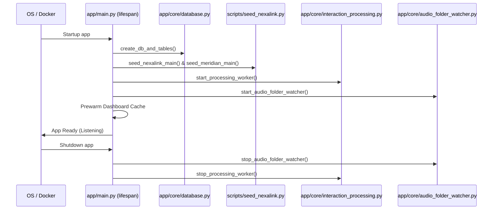

# VocalMind Backend Architecture

This document describes the design patterns, code structure, database routing, and background processing mechanics of the VocalMind FastAPI backend.

---

## 1. Directory Layout

The backend directory (`backend/app/`) is structured to enforce separation of concerns:

```text
backend/app/
├── main.py                # App factory, CORS configs, and startup/lifespan hooks
├── api/
│   ├── main.py            # Central router. Aggregates all 16 endpoint modules
│   ├── deps.py            # Dependency injection: DB, current user, and Supabase client
│   └── routes/            # Route controllers (interactions, dashboard, assistant, etc.)
├── core/
│   ├── config.py          # Settings(BaseSettings) loading env vars
│   ├── database.py        # SQLAlchemy async engine, session makers, table builders
│   ├── security.py        # JWT generation, verification, and password hashing
│   ├── audio_resolver.py  # Maps audio identifiers to local FS files or Supabase buckets
│   ├── emotion_fusion.py  # Fuses text and acoustic sentiment scores
│   ├── inference_contracts.py  # Normalizes responses from local/remote microservices
│   └── interaction_processing.py # Background processing task queue worker
├── llm_trigger/
│   ├── prompts.py         # Prompt templates protected by _INJECTION_GUARD
│   ├── chains.py          # LangChain LLM runnables (Ollama Cloud in prod; Groq fallback) with exponential backoffs
│   ├── retrieval.py       # Qdrant retrievers (SOP, Policy, and KB adaptors)
│   └── service.py         # Evaluating triggers (emotion shifts, compliance, NLI)
└── models/                # SQLModel ORM declarations mapping transactional tables
```

---

## 2. Startup Lifespan Lifecycle

The application lifecycle is managed via FastAPI's `lifespan` hook in `app/main.py`:



---

## 3. Dependency Injection (`app/api/deps.py`)

FastAPI's dependency injection (`Depends`) manages access to database engines and secure sessions:

*   **`get_db()`**: Yields an asynchronous SQLAlchemy session (`AsyncSession`) for relational queries. Wraps operations in transactional blocks, automatically rolling back on controller failures.
*   **`get_current_user()`**: Extracts the session JWT token from cookies or authorization headers. Validates claims, verifies expiration, checks if the user is active in PostgreSQL, and injects the authenticated `User` context into the controller.
*   **`get_supabase()`**: Returns a client connection to Supabase storage to handle remote audio uploads.

---

## 4. Environment Configurations (`app/core/config.py`)

System parameters are managed using Pydantic `BaseSettings`. The `Settings` object loads environment variables, enforcing types and validation:

1.  **Validation**: Pydantic validates connection formats (e.g. `DATABASE_URL` format).
2.  **Order of Precedence**: Values defined in shell environments override values in the local `.env` file, which override standard defaults.

---

## 5. In-Memory Background Worker

Processing audio files is a long-running operational task (speech-to-text, diarization, and LLM reasoning take substantial execution time). VocalMind avoids blocking HTTP request loops by offloading processing to an **in-memory async worker queue**:

1.  When an interaction is created, the system seeds 6 `ProcessingJob` records (representing stages from VAD to compliance scoring) marked as `pending`.
2.  The interaction ID is pushed to an internal `asyncio.Queue` queue.
3.  A dedicated worker task running in the background (`_worker_loop`) pops the interaction, claims it, releases DB resources, executes the steps, and records completions or traceback logs on failure.
