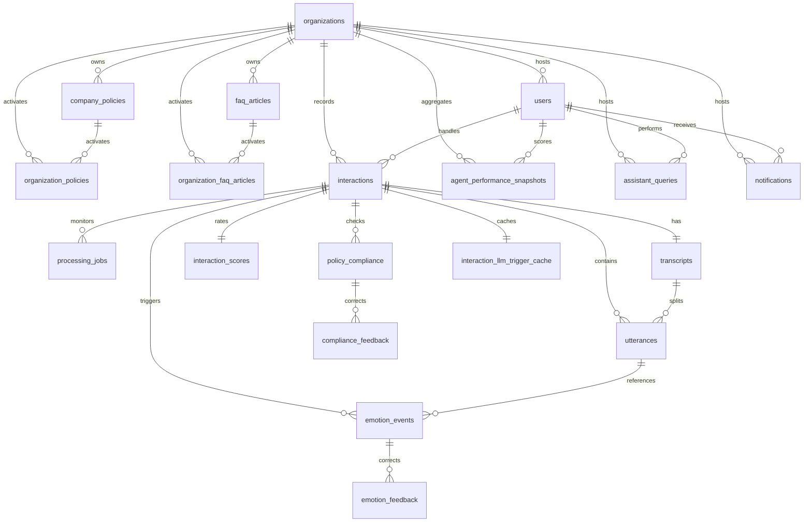

# VocalMind Database Schema Reference (v5.2)

VocalMind utilizes PostgreSQL as its primary transactional database. The schema is defined and managed via **SQLModel** (an ORM wrapping SQLAlchemy and Pydantic) on the backend and mapped directly via PostgreSQL DDL script in `infra/db/01_schema.sql`.

This document serves as the data dictionary and relationship guide for the 19 tables and 11 custom enum types.

---

## 1. Custom Enum Types

Custom PostgreSQL enum types isolate state values, guaranteeing database-level constraints.

*   `org_status_enum`: `('active', 'inactive', 'suspended')` - Organization lifecycle states.
*   `user_role_enum`: `('manager', 'agent')` - Controls portal permissions and route trees.
*   `agent_type_enum`: `('human', 'ai')` - Differentiates agent performance metrics.
*   `processing_status_enum`: `('pending', 'processing', 'completed', 'failed')` - High-level interaction processing state.
*   `job_stage_enum`: `('diarization', 'stt', 'emotion', 'reasoning', 'scoring', 'rag_eval')` - The six stages of the audio processing pipeline.
*   `job_status_enum`: `('pending', 'running', 'completed', 'failed')` - Status tracker for each pipeline stage.
*   `speaker_role_enum`: `('agent', 'customer')` - Labels speaker role for turns and segments.
*   `query_mode_enum`: `('voice', 'chat')` - Assistant conversation modes.
*   `feedback_status_enum`: `('pending', 'reviewed', 'applied')` - Lifecycle states of agent compliance/emotion disputes.
*   `period_type_enum`: `('daily', 'weekly', 'monthly')` - Aggregation periods for performance snapshots.
*   `notification_type_enum`: `('evaluation_complete', 'agent_flag_pending', 'flag_approved', 'flag_rejected', 'manager_correction', 'feedback_applied')` - In-app notification categories.

---

## 2. Table Directory

### 2.1 Core Multi-Tenancy

#### `organizations`
Defines the client boundary. All transactional data (users, calls, documents) must filter by organization.
*   `id` (UUID, PK): Unique identifier.
*   `name` (VARCHAR): Organization display name.
*   `slug` (VARCHAR, Unique): URL-safe identifier (e.g. `nexalink`, `cairoconnect`).
*   `status` (org_status_enum): Defaults to `active`.
*   `created_at` / `updated_at` (TIMESTAMPTZ): System timestamps.

#### `users`
Defines managers and agents.
*   `id` (UUID, PK)
*   `organization_id` (UUID, FK -> `organizations` ON DELETE CASCADE): Multi-tenant boundary.
*   `email` (VARCHAR, Unique)
*   `password_hash` (TEXT)
*   `name` (VARCHAR)
*   `avatar_url` (TEXT, Nullable): Optional profile photo URL.
*   `role` (user_role_enum): Manager or Agent.
*   `agent_type` (agent_type_enum, Nullable): Human or AI (must be null if user role is 'manager').
*   `is_active` (BOOLEAN): Defaults to True.
*   `last_login_at` (TIMESTAMPTZ, Nullable): Timestamp of the last user login.
*   `created_at` (TIMESTAMPTZ): User registration timestamp.

**Constraint:** `users_agent_type_role_check` — enforces that `agent_type` is `NULL` when `role = 'manager'`.

---

### 2.2 Ingestion & Processing Pipeline

#### `interactions`
Represents an uploaded call recording or one auto-ingested by the folder watcher.
*   `id` (UUID, PK)
*   `organization_id` (UUID, FK -> `organizations` ON DELETE CASCADE)
*   `agent_id` (UUID, FK -> `users`): The agent handling the call.
*   `uploaded_by` (UUID, FK -> `users`): The user who initiated the upload or system watcher.
*   `audio_file_path` (TEXT): Local file system path or Supabase storage path.
*   `file_size_bytes` (BIGINT)
*   `duration_seconds` (INTEGER)
*   `file_format` (VARCHAR): e.g. `wav`, `mp3`.
*   `interaction_date` (TIMESTAMPTZ): When the call occurred.
*   `processing_status` (processing_status_enum): defaults to `pending`.
*   `language_detected` (VARCHAR(10), Nullable): ISO code of the primary speech language.
*   `has_overlap` (BOOLEAN): Defaults to False. Set True if overlapping voices are detected.
*   `channel_count` (SMALLINT): Number of audio channels (mono=1, stereo=2).

**Constraint:** `uq_interaction_org_audio_path` — enforces uniqueness of `(organization_id, audio_file_path)`, preventing duplicate audio uploads within an organization.
**Note:** `agent_id` FK is ON DELETE CASCADE; `uploaded_by` FK has no cascade.

#### `processing_jobs`
Traces execution of the six stage pipeline for each interaction.
*   `id` (UUID, PK)
*   `interaction_id` (UUID, FK -> `interactions` ON DELETE CASCADE)
*   `stage` (job_stage_enum): The current pipeline stage (e.g. `stt`, `emotion`).
*   `status` (job_status_enum): Stage status (e.g. `completed`, `failed`).
*   `started_at` / `completed_at` (TIMESTAMPTZ, Nullable)
*   `error_message` (TEXT, Nullable): Logs python error traces on failure.
*   `retry_count` (SMALLINT): Tracks retry loops.

---

### 2.3 Transcript & Utterances

#### `transcripts`
Holds the centralized full text representation of a call.
*   `id` (UUID, PK)
*   `interaction_id` (UUID, Unique, FK -> `interactions` ON DELETE CASCADE)
*   `full_text` (TEXT, Nullable): Aggregated transcript text.
*   `overall_confidence` (FLOAT, Nullable): Speech-to-text accuracy confidence.

#### `utterances`
Segmented conversational turns.
*   `id` (UUID, PK)
*   `interaction_id` (UUID, FK -> `interactions` ON DELETE CASCADE)
*   `transcript_id` (UUID, FK -> `transcripts` ON DELETE CASCADE)
*   `speaker_role` (speaker_role_enum): Agent or Customer.
*   `user_id` (UUID, Nullable, FK -> `users`): Linked agent user profile, if matched.
*   `sequence_index` (INTEGER): Ordering index of the utterance.
*   `start_time_seconds` / `end_time_seconds` (FLOAT): Timestamps.
*   `text` (TEXT): The transcribed segment.
*   `emotion` (VARCHAR): Predicted emotion label (happy, angry, sad, neutral, etc.).
*   `emotion_confidence` (FLOAT): Emotion model classification score.

---

### 2.4 Triggers, Scores & Evaluation

#### `emotion_events`
Emotion shifts detected in a call. Used for explainability.
*   `id` (UUID, PK)
*   `interaction_id` (UUID, FK -> `interactions` ON DELETE CASCADE)
*   `utterance_id` (UUID, FK -> `utterances` ON DELETE CASCADE)
*   `previous_emotion` (VARCHAR, Nullable)
*   `new_emotion` (VARCHAR)
*   `emotion_delta` (FLOAT, Nullable)
*   `speaker_role` (speaker_role_enum): Who had the shift.
*   `llm_justification` (TEXT, Nullable): LLM explanation for the emotional shift trigger.
*   `jump_to_seconds` (FLOAT): Timestamp to jump to in the audio file.
*   `confidence_score` (FLOAT, Nullable): Speech-to-text or acoustic classification confidence.
*   `is_flagged` (BOOLEAN): True if disputed by the agent.
*   `agent_flagged_by` (UUID, FK -> `users`, Nullable): Agent who disputed.
*   `agent_flagged_at` (TIMESTAMPTZ, Nullable): When the dispute was submitted.
*   `agent_flag_note` (TEXT, Nullable): Dispute reasoning text.

**Constraint:** `emotion_events_agent_flag_consistency` — enforces that `agent_flagged_by` and `agent_flagged_at` are both set or both NULL.

#### `interaction_scores`
Overall and dimensional scores calculated at completion of pipeline.
*   `id` (UUID, PK)
*   `interaction_id` (UUID, Unique, FK -> `interactions` ON DELETE CASCADE)
*   `overall_score` (FLOAT, Nullable): General weighted percentage.
*   `empathy_score` / `policy_score` / `resolution_score` (FLOAT, Nullable): Dimensional KPI scores.
*   `was_resolved` (BOOLEAN, Nullable): Heuristic-derived outcome state.
*   `total_silence_seconds` / `avg_response_time_seconds` (FLOAT, Nullable): Timing metrics.
*   `scored_at` (TIMESTAMPTZ): When scores were computed. NOT NULL.

#### `policy_compliance`
Stores the results of policy evaluations against the transcript. Mirrors the agent-dispute workflow of `emotion_events`.
*   `id` (UUID, PK)
*   `interaction_id` (UUID, FK -> `interactions` ON DELETE CASCADE)
*   `policy_id` (UUID, FK -> `company_policies` ON DELETE CASCADE)
*   `is_compliant` (BOOLEAN, NOT NULL)
*   `compliance_score` (FLOAT, NOT NULL)
*   `degraded` (BOOLEAN): True when the verdict was downgraded by the LLM (e.g. partial compliance). Defaults to False.
*   `llm_reasoning` (TEXT)
*   `evidence_text` (TEXT)
*   `retrieved_policy_text` (TEXT)
*   `is_flagged` (BOOLEAN): True if an agent has disputed this verdict. Defaults to False.
*   `agent_flagged_by` (UUID, FK -> `users`, Nullable): Agent who submitted the dispute.
*   `agent_flagged_at` (TIMESTAMPTZ, Nullable): When the dispute was submitted.
*   `agent_flag_note` (TEXT, Nullable): Agent's written explanation for the dispute.

**Constraint:** `policy_compliance_agent_flag_consistency` — enforces that `agent_flagged_by`/`agent_flagged_at` are both set when `is_flagged = TRUE`.

---

### 2.5 Policy & FAQ Ingestion

#### `company_policies`
Source compliance documents parsed or created manually.
*   `id` (UUID, PK)
*   `organization_id` (UUID, FK -> `organizations` ON DELETE CASCADE)
*   `policy_title` / `policy_category` (VARCHAR)
*   `policy_text` (TEXT): Text content of the policy.
*   `is_active` (BOOLEAN)
*   `created_at` / `updated_at` (TIMESTAMPTZ): Timestamps of policy definition.

#### `organization_policies`
Bridge table mapping active policies to organizations.
*   `id` (UUID, PK)
*   `organization_id` (UUID, FK -> `organizations` ON DELETE CASCADE)
*   `policy_id` (UUID, FK -> `company_policies` ON DELETE CASCADE)
*   `is_active` (BOOLEAN)
*   `assigned_at` (TIMESTAMPTZ): Assignment timestamp.

#### `faq_articles`
FAQ question/answer pairs scoped to organizations.
*   `id` (UUID, PK)
*   `organization_id` (UUID, FK -> `organizations` ON DELETE CASCADE)
*   `question` (TEXT): The FAQ question.
*   `answer` (TEXT): The FAQ answer.
*   `category` (VARCHAR): Article category.
*   `is_active` (BOOLEAN): Active article indicator.
*   `created_at` / `updated_at` (TIMESTAMPTZ): System timestamps.

#### `organization_faq_articles`
Bridge table mapping active FAQ articles to organizations.
*   `id` (UUID, PK)
*   `organization_id` (UUID, FK -> `organizations` ON DELETE CASCADE)
*   `article_id` (UUID, FK -> `faq_articles` ON DELETE CASCADE)
*   `is_active` (BOOLEAN): Activation status.
*   `assigned_at` (TIMESTAMPTZ): Assignment timestamp.

---

### 2.6 Feedback & RLHF Loop

#### `emotion_feedback`
Manager corrections for disputed emotion labels.
*   `id` (UUID, PK)
*   `emotion_event_id` (UUID, FK -> `emotion_events` ON DELETE CASCADE)
*   `provided_by_user_id` (UUID, FK -> `users` ON DELETE CASCADE): Manager reviewer.
*   `llm_justification` (TEXT, Nullable): Saved reasoning from the original event.
*   `corrected_emotion` (VARCHAR): Emotion label manually selected by the manager.
*   `corrected_justification` (TEXT, Nullable): Manager justification for the correction.
*   `correction_reason` (TEXT, Nullable): Additional notes.
*   `feedback_status` (feedback_status_enum): Defaults to `pending`.
*   `is_used_in_training` (BOOLEAN): Indicates if training extraction was completed.
*   `created_at` (TIMESTAMPTZ): Review submission time.

#### `compliance_feedback`
Manager corrections for policy compliance verdicts.
*   `id` (UUID, PK)
*   `policy_compliance_id` (UUID, FK -> `policy_compliance` ON DELETE CASCADE)
*   `provided_by_user_id` (UUID, FK -> `users` ON DELETE CASCADE): Manager reviewer.
*   `original_is_compliant` (BOOLEAN): Original AI classification.
*   `corrected_is_compliant` (BOOLEAN): Manager-corrected compliance status.
*   `original_score` (FLOAT, Nullable): Original compliance score.
*   `corrected_score` (FLOAT, Nullable): Corrected score.
*   `correction_reason` (TEXT, Nullable): Reason for dispute resolution.
*   `feedback_status` (feedback_status_enum): Defaults to `pending`.
*   `is_used_in_training` (BOOLEAN): Training extract status.
*   `created_at` (TIMESTAMPTZ): Review submission time.

---

### 2.7 Snapshots & Conversation Logs

#### `agent_performance_snapshots`
Pre-aggregated periodic agent performance metrics.
*   `id` (UUID, PK)
*   `organization_id` (UUID, FK -> `organizations` ON DELETE CASCADE)
*   `agent_id` (UUID, FK -> `users` ON DELETE CASCADE): Agent being measured.
*   `period_type` (period_type_enum): daily, weekly, or monthly snapshots.
*   `period_start` / `period_end` (DATE): Snapshot boundaries.
*   `total_interactions` (INTEGER): Interacted call count.
*   `avg_overall_score` (FLOAT, Nullable): Average performance percentage.
*   `avg_empathy_score` / `avg_policy_score` / `avg_resolution_score` (FLOAT, Nullable): KPI averages.
*   `resolution_rate` (FLOAT, Nullable): Percentage of resolved interactions.
*   `computed_at` (TIMESTAMPTZ): Snapshot generation time.

#### `assistant_queries`
User interaction history with the Assistant chat portal.
*   `id` (UUID, PK)
*   `user_id` (UUID, FK -> `users` ON DELETE CASCADE)
*   `organization_id` (UUID, FK -> `organizations` ON DELETE CASCADE)
*   `query_mode` (query_mode_enum): voice or chat mode.
*   `audio_input_path` (TEXT, Nullable): Path to raw voice audio, if voice query.
*   `query_text` (TEXT): Natural language input query.
*   `ai_understanding` (TEXT, Nullable): Parsed intent.
*   `generated_sql` (TEXT, Nullable): Executed read-only SQL query.
*   `response_text` (TEXT, Nullable): Generated reply.
*   `execution_time_ms` (INTEGER, Nullable): Response latency in milliseconds.
*   `result_rows` (JSONB, Nullable): Fetched data payload.
*   `created_at` (TIMESTAMPTZ): Logging time.

#### `interaction_llm_trigger_cache`
Runtime cache for expensive three-chain LLM reports.
*   `id` (UUID, PK)
*   `interaction_id` (UUID, UNIQUE, FK -> `interactions` ON DELETE CASCADE)
*   `org_filter` (VARCHAR, Nullable): Associated organization display boundary.
*   `report_payload` (JSONB): Fully detailed JSON reports.
*   `computed_at` (TIMESTAMPTZ): Cache creation timestamp.

#### `notifications`
In-app notification records for system alerts and coaching updates.
*   `id` (UUID, PK)
*   `recipient_user_id` (UUID, FK -> `users` ON DELETE CASCADE): Target user.
*   `organization_id` (UUID, FK -> `organizations` ON DELETE CASCADE): Tenant scope.
*   `type` (notification_type_enum): Category — one of `evaluation_complete`, `agent_flag_pending`, `flag_approved`, `flag_rejected`, `manager_correction`, `feedback_applied`.
*   `title` (VARCHAR): Short title of the alert.
*   `body` (TEXT, Nullable): Long body details.
*   `link_url` (VARCHAR, Nullable): Redirect link.
*   `payload` (JSONB, Nullable): Free-form context payload dictionary.
*   `is_read` (BOOLEAN): Read status flag. Defaults to `false`.
*   `read_at` (TIMESTAMPTZ, Nullable): Timestamp when read.
*   `created_at` (TIMESTAMPTZ): Notification generation timestamp.

---

## 3. Core Database Relationships (Entity Relationship Diagram)

---

## 4. Database Indexes

VocalMind defines 20 database indexes to accelerate multi-tenant filters and transactional lookups:

*   `idx_users_organization_id`: Speeds up org user lookups.
*   `idx_interactions_organization_id`: Filters interactions by organization boundary.
*   `idx_interactions_agent_id`: Filters agent calls.
*   `idx_interactions_date`: Orders interactions chronologically.
*   `idx_processing_jobs_interaction_id`: Speeds up job status updates.
*   `idx_transcripts_interaction_id`: Resolves interaction transcript references.
*   `idx_utterances_interaction_id`: Speeds up transcript segment queries.
*   `idx_emotion_events_interaction_id`: Resolves call emotion events.
*   `idx_emotion_events_agent_flagged`: Partial index on `agent_flagged_by` where not null, optimizing the manager's dispute review queue.
*   `idx_organization_policies_org_id`: Speeds up active compliance policy resolution.
*   `idx_policy_compliance_interaction_id`: Filters compliance checks.
*   `idx_policy_compliance_agent_flagged`: Partial index on `agent_flagged_by` where not null, optimizing compliance dispute reviewer queues.
*   `idx_notifications_recipient_unread`: Combined index on `recipient_user_id` and `is_read` to quickly fetch unread notifications.
*   `idx_notifications_org`: Filters notifications by tenant boundary.
*   `idx_notifications_created_at`: Orders notifications chronologically (descending).
*   `idx_agent_snapshots_agent_id`: Speeds up agent KPI dashboard rendering.
*   `idx_assistant_queries_user_id`: Filters manager assistant conversation histories.
*   `idx_interaction_llm_trigger_cache_interaction_id`: Resolves LLM trigger caches.
*   `idx_company_policies_organization_id`: Resolves organization policies.
*   `idx_faq_articles_organization_id`: Filters FAQs by tenant.

