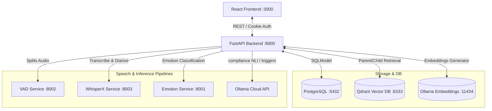

# VocalMind System Architecture & Overview

This document provides a high-level technical overview of the VocalMind platform, outlining the system components, network topology, multi-tenancy model, and execution configurations.

---

## 1. High-Level Architecture Diagram

VocalMind integrates speech processing pipelines, vector-grounded retrieval-augmented generation (RAG), and a secure multi-tenant web application. Below is the network and component interaction topology:

---

## 2. Component Responsibilities

The system is decoupled into modular services to allow independent scaling, developer isolation, and flexible execution constraints:

| Component | Port | Technology | Purpose |
| :--- | :--- | :--- | :--- |
| **Frontend** | `:3000` | React 18, Vite, Tailwind v4, Material UI | Single Page Application presenting role-based dashboards (Manager and Agent views), detailed call transcript inspector, interactive evidence panels, and AI assistant query chats. |
| **Backend Gateway** | `:8000` | FastAPI, SQLModel (SQLAlchemy) | Exposes REST endpoints, validates schemas, enforces RBAC policies, manages session-state caches, runs the background audio scanner, and orchestrates call processing. |
| **VAD Service** | `:8002` | Silero VAD, FastAPI wrapper | Voice Activity Detection service. Evaluates raw audio streams to isolate precise timestamp segments containing speech. |
| **WhisperX Service** | `:8003` | WhisperX, pyannote | Performs speech-to-text, forced word-level alignment, and speaker diarization. Agent/Customer role mapping is done downstream in the backend. |
| **Emotion Service** | `:8001` | funASR emotion2vec, FastAPI | Speech emotion recognition. Generates classification probability vectors across 7 canonical emotion labels for mono audio segments. |
| **RAG Vector DB** | `:6333` | Qdrant Vector DB | Stores parsed policy, SOP, and knowledge base document chunks. Supports segmented payloads filtered by multi-tenant organization IDs. |
| **Ollama** | `:11434` | Ollama (`snowflake-arctic-embed2`) | Host-local embedding server utilized to generate dense vector representations of policy and Q&A documents. |
| **Relational Database**| `:5432` | PostgreSQL | Enforces transactional database integrity, storing multi-tenant tables, transcripts, scores, and disputes. |

---

## 3. The `IS_LOCAL` Switch

A core operational setting in VocalMind is the `IS_LOCAL` variable, configured in `backend/.env`. This switch routes inference processing based on host performance constraints:

*   **`IS_LOCAL=true`**: All audio pipelines (VAD, WhisperX, Emotion) are routed directly to the local microservice containers on ports `:8001`, `:8002`, and `:8003`. This mode requires substantial local GPU/CPU resources.
*   **`IS_LOCAL=false`**: Inference processing is routed to a remote Kaggle server using a secure HTTPS client client wrapper (`BaseKaggleClient`). This is ideal for developers without local GPU hardware.

---

## 4. Multi-Tenancy Scoping Model

All transactional data in VocalMind is isolated using a **three-tier multi-tenancy scoping pattern**:

1.  **Organization Boundary**: Every tenant is defined by an `Organization` record (e.g. `NexaLink`, `Meridian`). 
2.  **User Scoping**: Users (Managers and Agents) belong to a specific organization. Managers can see all interactions within the organization, while Agents are restricted to interactions where they are the primary agent assigned.
3.  **Grounding Scoping**: Policies, SOPs, and KB documents are ingested into Qdrant using payload filters mapping the organization's unique ID. Retrieval operations always inject organization filters, ensuring RAG queries never leak across tenants.
