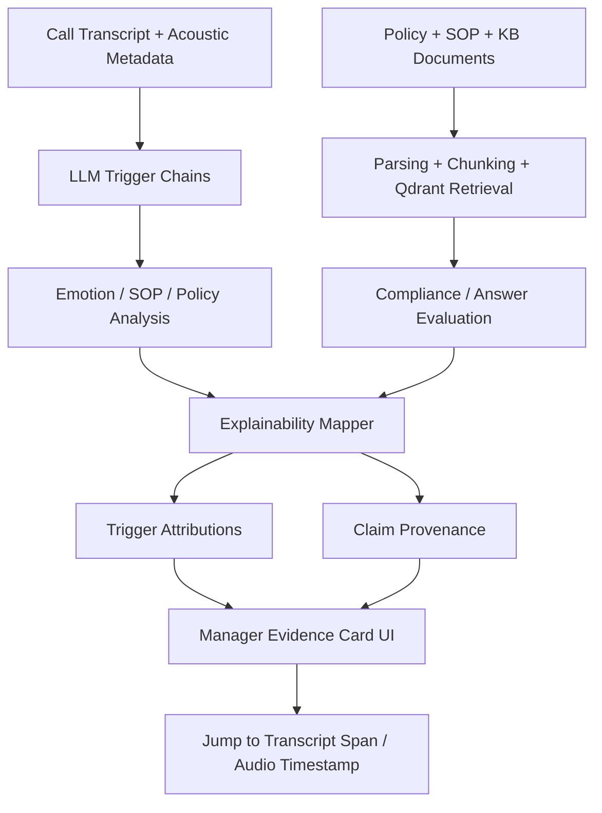
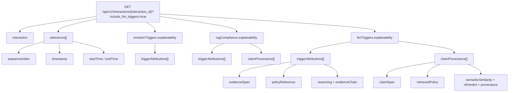

# Evidence-Anchored Explainability Layer

## Purpose

The Evidence-Anchored Explainability Layer turns opaque trigger and compliance outputs into traceable manager-facing evidence cards.

Instead of only returning a session-level verdict like:

- `Contradiction Trigger fired`
- `Correctness Score: 62`

the system now surfaces:

1. The exact transcript span that triggered review
2. The SOP, policy, or knowledge base clause used as the reference point
3. The verdict produced from that comparison
4. A short reasoning chain a supervisor can act on

This layer unifies two previously separate outputs:

1. Span-Level Trigger Attribution
2. Retrieval Provenance Scoring

## Why It Exists

Before this layer, both evaluation paths had the same weakness:

1. LLM Trigger could flag a behavioral issue without showing which utterance caused it
2. RAG Compliance could score or judge a claim without showing which retrieved policy chunk supported the decision

The explainability layer fixes that by standardizing the path:

`claim or trigger -> evidence -> verdict`

## Scope

This layer currently covers:

1. Emotion-trigger reasoning
2. SOP/process-adherence reasoning
3. Policy/NLI reasoning
4. Knowledge Base claim validation (KB references surfaced with distinct styling)
5. Claim-level retrieval provenance for policy-grounded compliance review

It is surfaced in:

1. `GET /api/v1/interactions/{interaction_id}?include_llm_triggers=true`
2. `POST /api/v1/rag/query`
3. The manager session detail page Evidence Card UI

## Architecture

```text
Call transcript + acoustic metadata
    -> LLM trigger chains
    -> process adherence / NLI policy analysis
    -> explainability mapper

Policy + SOP + Knowledge Base documents
    -> Docling parsing
    -> chunking + Qdrant retrieval (policy -> vocalmind_parents, SOP/KB -> vocalmind_sop_parents)
    -> compliance / answer / claim validation checks
    -> explainability mapper

Both paths feed one manager-facing contract:
    triggerAttributions + claimProvenance
```

## Architecture Diagram



This diagram shows the key idea behind the feature:

1. Trigger-side reasoning and retrieval-side reasoning are generated separately
2. Both are normalized into one explainability contract
3. The manager UI consumes that shared contract and links it back to the original call

## Core Backend Files

1. `backend/app/llm_trigger/schemas.py`
- Defines the internal explainability models:
  - `EvidenceSpan`
  - `PolicyReference`
  - `TriggerAttribution`
  - `ClaimProvenance`
  - `EvidenceAnchoredExplainability`

2. `backend/app/llm_trigger/service.py`
- Builds explainability output during trigger evaluation
- Joins transcript evidence, retrieval context, and verdict-specific reasoning

3. `backend/app/llm_trigger/retrieval.py`
- Provides shared retrieval helpers used by explainability paths
- Supplies real retrieval context for SOP/policy provenance when available

4. `backend/app/api/routes/interactions.py`
- Maps internal explainability models into the frontend response contract
- Exposes explicit response models for OpenAPI

5. `backend/app/api/routes/rag.py`
- Adds `retrieval_provenance` to standalone RAG query responses

## Core Frontend Files

1. `frontend/src/app/services/api.ts`
- Declares the explainability payload types used by the UI

2. `frontend/src/app/components/manager/EvidenceAnchoredExplainabilityPanel.tsx`
- Renders trigger attribution cards and claim provenance cards

3. `frontend/src/app/components/manager/SessionDetail.tsx`
- Aggregates explainability from interaction detail data
- Wires card timestamps to audio jump targets

## Main Concepts

### 1. Span-Level Trigger Attribution

This is used for LLM-trigger-style findings such as:

1. Acoustic-transcript dissonance
2. SOP violation
3. Policy contradiction

Each trigger card can contain:

1. `triggerType`
2. `title`
3. `verdict`
4. `confidence`
5. `evidenceSpan`
6. `policyReference`
7. `reasoning`
8. `evidenceChain`
9. `supportingQuotes`

### 2. Retrieval Provenance Scoring

This is used for factual or compliance claims made in the call.

Each claim card can contain:

1. `claimText`
2. `claimSpan`
3. `retrievedPolicy`
4. `semanticSimilarity`
5. `nliVerdict`
6. `confidence`
7. `reasoning`
8. `provenance`
9. `supportingQuotes`

## Interaction Detail API Surface

The main explainability payload is returned from:

`GET /api/v1/interactions/{interaction_id}?include_llm_triggers=true`

Relevant response fields:

### Transcript anchoring

1. `utterances[].sequenceIndex`
- Stable utterance index for evidence cards

2. `utterances[].startTime`
3. `utterances[].endTime`
4. `utterances[].timestamp`

These support UI jump-to-audio behavior.

### Explainability containers

1. `emotionTriggers.explainability.triggerAttributions`
2. `ragCompliance.explainability.triggerAttributions`
3. `ragCompliance.explainability.claimProvenance`
4. `llmTriggers.explainability`

`llmTriggers.explainability` is the combined manager-facing aggregation used by the current session-detail UI.

## API Payload Diagram



This payload view highlights the important implementation detail:

1. utterances provide the stable timing and indexing anchors
2. emotion and RAG paths each produce explainability artifacts
3. `llmTriggers.explainability` is the merged manager-facing contract used by the UI

## Response Shape

### Trigger attribution

```json
{
  "attributionId": "sop-identity-1",
  "family": "sop",
  "triggerType": "SOP Violation",
  "title": "Identity Verification",
  "verdict": "Contradiction",
  "confidence": 0.74,
  "evidenceSpan": {
    "utteranceIndex": 12,
    "speaker": "agent",
    "quote": "Let me pull up your account.",
    "timestamp": "01:43",
    "startSeconds": 103.0,
    "endSeconds": 106.0
  },
  "policyReference": {
    "source": "sop",
    "reference": "Identity SOP",
    "clause": "Agent must ask for full name and date of birth before account lookup.",
    "version": "v2.3",
    "category": "Verification",
    "provenance": "parsed-docs/identity.md > Verification Steps"
  },
  "reasoning": "The agent proceeded to account lookup before collecting the required credentials.",
  "evidenceChain": [
    "Customer requested account help.",
    "Agent initiated lookup language.",
    "No verification step was detected before the lookup attempt."
  ],
  "supportingQuotes": [
    "Let me pull up your account."
  ]
}
```

### Claim provenance

```json
{
  "claimId": "refund-claim-1",
  "claimText": "Your refund will arrive within 24 hours.",
  "claimSpan": {
    "utteranceIndex": 22,
    "speaker": "agent",
    "quote": "Your refund will arrive within 24 hours.",
    "timestamp": "03:17",
    "startSeconds": 197.0,
    "endSeconds": 200.0
  },
  "retrievedPolicy": {
    "source": "policy",
    "reference": "Refunds Policy v2.3",
    "clause": "Standard refunds take 3-5 business days.",
    "version": "v2.3",
    "category": "Refund Timelines",
    "provenance": "children chunk #47 > parent section Refund Timelines"
  },
  "semanticSimilarity": 0.81,
  "nliVerdict": "Contradiction",
  "confidence": 0.80,
  "reasoning": "The promise conflicts with the active refund timeline in the retrieved policy.",
  "provenance": "Refunds Policy v2.3 > Refund Timelines > chunk 47",
  "supportingQuotes": [
    "Your refund will arrive within 24 hours."
  ]
}
```

## Standalone RAG API Surface

The standalone RAG route returns lightweight provenance on:

`POST /api/v1/rag/query`

Response field:

1. `retrieval_provenance`

Each item contains:

1. `claim`
2. `chunkRank`
3. `semanticSimilarity`
4. `verdict`
5. `reference`
6. `excerpt`
7. `provenance`

This route is simpler than the interaction-detail explainability contract, but it exposes the same core idea: retrieved evidence should be visible, not hidden behind a score.

## Frontend Behavior

The manager Evidence Card UI currently:

1. Groups trigger cards under `Span-Level Trigger Attribution`
2. Groups claim cards under `Retrieval Provenance Scoring`
3. Shows confidence and verdict badges
4. Displays the evidence quote and policy/SOP/KB clause side by side
5. Renders document type labels with distinct styling:
   - Policy clauses: orange theme
   - SOP clauses: orange theme
   - Knowledge Base references: indigo theme
6. Lets the user jump from a card timestamp back into audio playback

The page also counts evidence cards in the session hero so supervisors can immediately see whether a call has traceable findings.

## Real Signals vs Fallbacks

The implementation prefers real pipeline signals whenever they are available.

Currently supported:

1. Real utterance span anchoring from transcript timing
2. Real retrieval provenance from retrieved policy/SOP context
3. Real model-reported confidence for supported trigger paths when available
4. Real similarity values from retrieved chunks where the retrieval layer exposes scores

When a score is not available, the frontend shows `N/A` instead of inventing a value.

## Testing

Current tests that cover this layer:

1. `backend/tests/test_interactions_llm_triggers.py`
- Verifies explainability fields are mapped into the API payload

2. `backend/tests/test_sop_retrieval.py`
- Verifies SOP retrieval context used by explainability paths

3. `frontend/src/tests/SessionDetail.test.tsx`
- Verifies evidence cards render in the manager session detail page

4. `frontend/src/tests/LLMTriggerSections.test.tsx`
- Verifies trigger sections and explainability-related manager detail rendering

## Suggested Evaluation for the Project Report

If this layer is presented as a research contribution, the recommended evaluation is:

1. Have 2-3 human supervisors annotate a set of call segments
2. Record:
- which utterance span they would flag
- why they flagged it
- which policy/SOP clause they used

3. Compare system output against human annotations using:
- span-level F1
- qualitative reasoning agreement
- correlation between provenance-backed claim verdicts and human compliance judgments

## Known Limitations

1. Explainability quality still depends on transcript quality and retrieval quality
2. Some confidence values depend on whether the underlying chain exposes model confidence
3. The standalone RAG route currently returns a lightweight provenance shape, not the full interaction-detail explainability model
4. Human evaluation is not yet automated in the repo and should be run as a separate study workflow

## Recommended Maintenance Workflow

When changing trigger logic, retrieval logic, or evidence-card UI:

1. Update the schema in `backend/app/llm_trigger/schemas.py` if the contract changes
2. Update the route response models in `backend/app/api/routes/interactions.py`
3. Update frontend types in `frontend/src/app/services/api.ts`
4. Update the Evidence Card renderer in `frontend/src/app/components/manager/EvidenceAnchoredExplainabilityPanel.tsx`
5. Re-run the targeted backend and frontend tests that cover explainability

This keeps the implementation, OpenAPI contract, and manager UI aligned.
