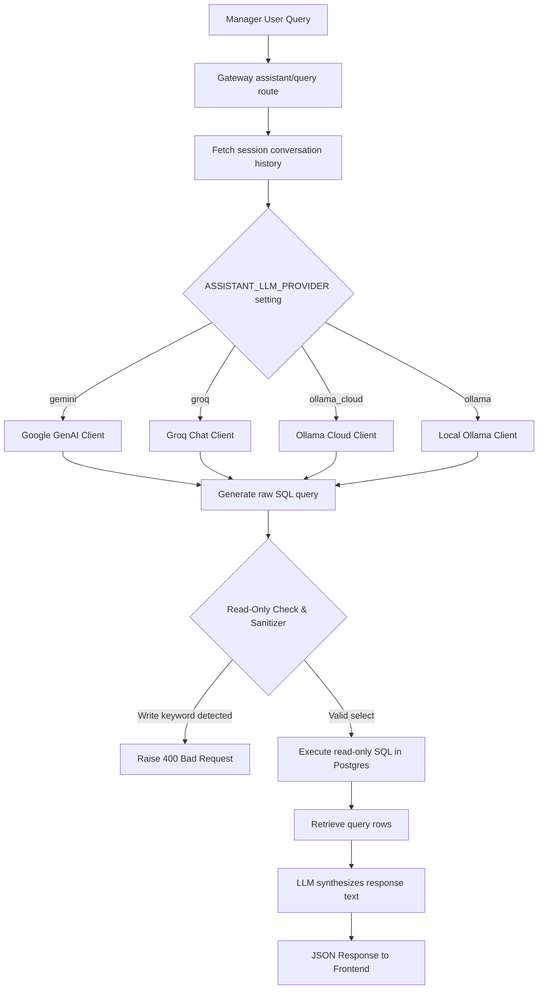

# AI Manager Assistant (Text-to-SQL)

The AI Manager Assistant is a natural language interface that allows managers to query performance, metrics, and call details using natural language.

---

## 1. Text-to-SQL Architecture

The Assistant parses natural language inputs and translates them into SQL using LLMs. Below is the operational flow:

---

## 2. LLM Provider Fallbacks

Assistant generation is managed via GenAI endpoints depending on `ASSISTANT_LLM_PROVIDER`:

1.  **Google GenAI (Gemini)**: The primary engine if `GOOGLE_API_KEY` is set. Candidates are tried in order: `gemini-2.0-flash`, `gemini-2.5-flash`, `gemini-1.5-flash`.
2.  **Groq (Llama-3)**: The secondary cloud provider if Gemini is disabled or credentials are missing.
3.  **Ollama Cloud (Ollama Cloud Pro)**: The tertiary cloud provider mapping to `OLLAMA_CLOUD_HEAVY_MODEL` (e.g. `kimi-k2.6:cloud` or custom `OLLAMA_MODEL_TEXT_TO_SQL`).
4.  **Local Ollama (qwen2.5:7b)**: The local fallback engine. If cloud models fail or return rate-limit errors, the backend routes generation locally to Ollama, ensuring continuous service availability.

In `auto` mode, the provider fallback order is: **Gemini → Groq → Ollama Cloud → Local Ollama**.

---

## 3. Security & Safety Controls

Because the Assistant translates text into executable database commands, the gateway enforces safety checks:

*   **Read-Only Strictness**: The Assistant parses the generated SQL using regular expressions and string checks. If it contains words like `INSERT`, `UPDATE`, `DELETE`, `DROP`, `ALTER`, `TRUNCATE`, or `CREATE`, the query is blocked.
*   **Database Transaction Isolation**: The SQL is executed in a read-only transaction context to prevent unauthorized writes.

---

## 4. Operational Features

*   **Ordinal References**: The Assistant preserves conversation state. If a manager asks *"Show me Priya's calls"* and follows up with *"Show me details for the second one"*, the assistant resolves "the second one" based on the previous query results.
*   **SQL Repair**: If the generated SQL returns a database syntax error, the assistant catches the error, appends it to a correction prompt, and queries the LLM again to repair the syntax.
